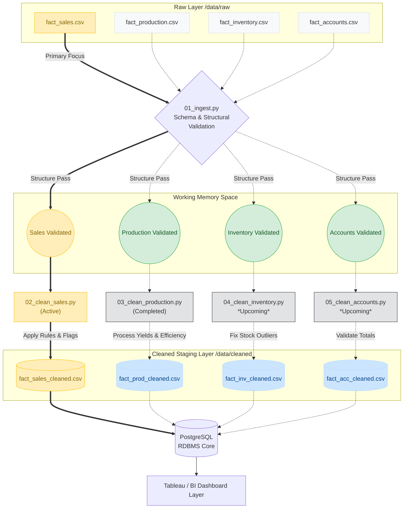

# Documentation: 02_clean_sales.py

## Overview
`02_clean_sales.py` acts as the **Sales Data Cleaning Layer** of the MSRB SONS Dairy Product Pvt. Ltd. Analytics Pipeline. Its primary job is to take raw, messy data (`fact_sales.csv`) and apply strict standardization, formatting, and mathematical rules to convert it into a fully validated and trusted dataset (`fact_sales_cleaned.csv`).

By ensuring bad data is flagged early instead of moving forward, it prevents broken dashboards and inaccurate analytics down the line. If bad data goes into our database, it leads to bad decisions.

## Step-by-Step Data Processing

1. **Step 1: Strip Whitespaces**: Automatically targets all text columns (`product_name`, `customer_name`, etc.) and eliminates extra leading or trailing spaces.
2. **Step 2: Date Validation**: Converts the `date` column into standard datetimes. Unparseable dates are replaced with NaNs and dropped. It also filters out out-of-range dates using the predefined boundaries `DATE_START` and `DATE_END`.
3. **Step 3: Categorical Standardization**: Forces text into standard casing conventions (e.g., `.title()` for `category`, `customer_type`, `route_name`). It uses strict reference values (`VALID_CATEGORIES`, `VALID_PAYMENT_MODES`, `VALID_CUSTOMER_TYPES`, `VALID_ROUTE_NAME`) to check validity and flags anomalies with specific `data_quality_flag`s.
4. **Step 4: Numeric Validation**: Casts essential columns (`quantity`, `unit_price`, `gross_amount`, `discount`, `net_amount`) into numeric data types, dropping unrecoverable missing ones for core columns. Crucially, it finds specific negative numbers and flags them as `NEGATIVE_...` so they can be recovered later, rather than deleting those rows outright.
5. **Step 5: Business Rule Validations**:
   - **Rule 1**: Validates that `gross_amount == quantity * unit_price`, allowing a gentle 1% tolerance for systemic rounding mismatches or unrecorded discounts in the raw entry.
   - **Rule 2**: Validates that `net_amount == gross_amount - discount`.
   - **Rule 3**: Checks if the applied discount exceeds 20% of the gross sale. If it does, a warning goes to the manager to review (fake invoice or heavy loss).
   - **Rule 4**: Ensures the `net_amount` is never zero or negative (`net_amount <= 0`) and assigns a `ZERO_OR_NEGATIVE_NET` flag if found.
6. **Step 6: Remove Duplicates**: Uses the transaction identifier (`sale_id`) to find duplicate rows, explicitly dropping all but the very first occurrence.
7. **Step 7: Derived Columns**: Calculates and appends new features that are vital for analytics:
   - `day_of_week` & `is_weekend` identifiers.
   - `financial_year` using standard April-March business logic.
   - `revenue_band` buckets (e.g., '<500', '10K+') grouping items via `pd.cut`.
8. **Step 8: Output**: Intermediary helper columns (like temporary math columns `calc_gross`, `gross_pct_err`, etc.) are cleanly jettisoned, and a comprehensive data summary profile is output into the logs. The final DataFrame exports cleanly to the `/data/cleaned/` directory.

---

## Data Flow Diagram

The following architectural flow maps out the lifecycle of the sales dataset specifically, displaying its interactions with ingest boundaries across the analytical layers.

