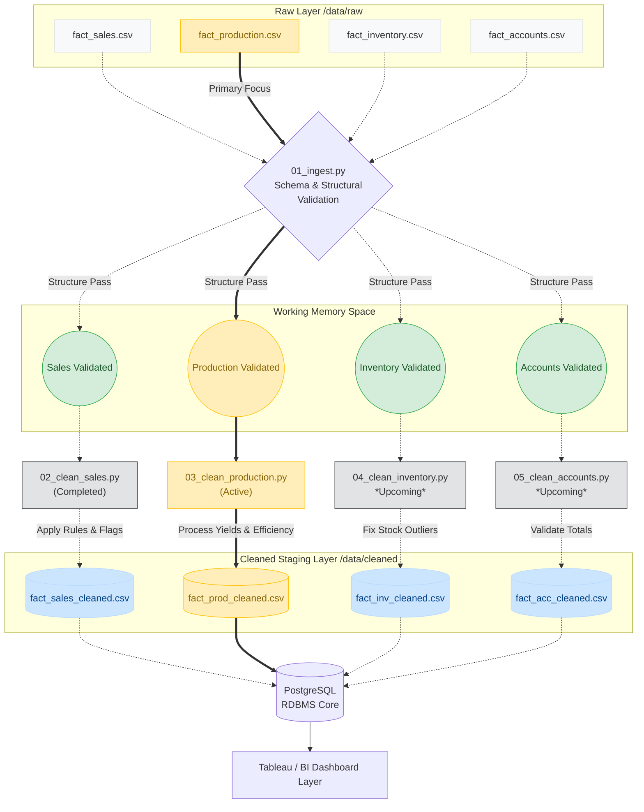

# Documentation: 03_clean_production.py

## Overview
`03_clean_production.py` acts as the **Production Data Cleaning Layer** of the MSRB SONS Dairy Product Pvt. Ltd. Analytics Pipeline. Its primary responsibility is to transform raw production data (`fact_production.csv`) into a verified and deeply validated dataset (`fact_production_cleaned.csv`).

This process ensures that quantities, production shifts, waste logs, and product categories meet the strict business and operational rules of the dairy workflow. Through error correction and feature engineering, it guarantees that analytics dashboards will only consume trusted figures.
## The Real-World Business Story Behind Production Columns

To ensure we build reliable metrics, it's vital to map our data fields directly to the physical factory floor inside the dairy.

| Column | Real-World Definition | Typical Dairy Benchmarks & Scenarios |
| :--- | :--- | :--- |
| **`planned_qty`** | Target volume set earlier by shift managers to fulfill pending orders and utilize the fresh raw milk deliveries. | *If Ghee orders hit 15, manager sets planned = 20.* |
| **`actual_qty`** | Final tallied output successfully completed. Almost strictly `≤ planned_qty` in realistic bounds due to machine downtime and cleanup. | *Planned 20, but due to delays, actual produced = 18 units.* |
| **`wastage_qty`** | Product processed but functionally rejected or lost mid-process (seal failure, spillage, color defects). | *Normal acceptable dairy benchmarks sit roughly at 1-3%.* |
| **`net_produced_qty`** | True cleared stock. It drives our external tables: this directly transforms into `received_qty` in our Inventory flow. | *18 units (actual) - 1 unit (waste) = 17 net units sent to storage.* |
| **`raw_milk_used_L`** | Core material fuel metric. Total raw liters used to hit the `actual_qty`. Varies extensively by item (e.g. 1L Ghee demands 20L Raw Milk, while 1L Curd needs ~1.1L Raw Milk). | *If 18 Ghee units outputted, raw input consumed was 18 * 20 = 360L.* |
| **`production_efficiency_%`** | Direct measurement `(actual / planned) * 100`. Highlights process bottlenecks dynamically over varying machine operators and equipment sets. | *Under `90%` flags "Poor/Critical" delays; typically averages ~93%.* |
| **`wastage_rate_%`** | Ratio of loss `(wastage / actual) * 100`. Tells management precisely if equipment requires immediate calibration or servicing. | *Average observed safely rides at ~1.98%.* |

### Data Link Integration
```text
6:00 AM — Fresh raw milk arrives -> (e.g., 2,800 kg inventory base)   
7:00 AM — Allocation (Planned qty initialized based on quotas)  
2:00 PM — Shift concludes (Actual qty + Milk Liters finalized)
2:30 PM — Quality control (Wastage counted, Net finalized)      
3:00 PM — fact_inventory ingest receives 'Net Produced Qty'
``` 

## Step-by-Step Data Processing
1. **Step 1: Strip Whitespaces**: Automatically targets all text columns and eliminates leading or trailing spaces to avoid hidden duplicate states.
2. **Step 2: Date Validation**: Converts the `date` column into a standard datetime format. Unparseable dates are dropped, and an explicit date bound check is implemented utilizing `DATE_START` and `DATE_END`.
3. **Step 3: Categorical Standardization**: Forces key textual features (`category`, `shift`) into `.title()` casing. The script restricts acceptable values to `VALID_CATEGORIES` (e.g., Paneer, Curd, Ghee) and `VALID_SHIFTS` (Morning, Evening), applying a `data_quality_flag` if invalid entries appear.
4. **Step 4: Cast and Validate Numerics**: Coerces critical fields (`planned_qty`, `actual_qty`, `wastage_qty`, etc.) into numeric types. Missing core production quantities result in structural row droppings. Additionally, impossible states like negative quantities are detected and forcefully clipped back to `0`.
5. **Step 5: Business Rule Validations**:
   - **Rule 1: Over-production**: Logs instances where actual yields exceed planned yields by over 110%.
   - **Rule 2: Impossible Wastage**: Detects and corrects occurrences where recorded wastage exceeds total actual production (resetting `wastage_qty` to 0).
   - **Rule 3: Net Produced**: Standardizes mathematical logic: `net_produced = actual - wastage`.
   - **Rule 4 & 5: Percentages**: Calculates robust `production_efficiency_%` and `wastage_rate_%` measures, safely handling divide-by-zero occurrences.
6. **Step 6: Remove Duplicates**: Isolates `production_id` duplicate logs to ensure absolute uniqueness per production batch. Dropping occurs cleanly by keeping the first occurrence.
7. **Step 7: Derived Analytics Columns**: Augments data structure with time intelligence (`day_of_week` and Indian `financial_year`) and introduces `efficiency_band`. Bands group items seamlessly intuitively:
   - *Critical (<85%)*
   - *Poor (85-90%)*
   - *Fair (90-95%)*
   - *Good (95-100%)*
   - *Excellent (>100%)*
8. **Final Data Output**: Applies Data Quality Flags dynamically for instances of over-production and high wastage. A summary log output reflects total yields parsed and the final result writes to the `/data/cleaned/` directory.

---

## Data Flow Diagram

The following architectural flow maps out the lifecycle of the production dataset specifically, displaying its interactions with ingest boundaries across the analytical layers.


