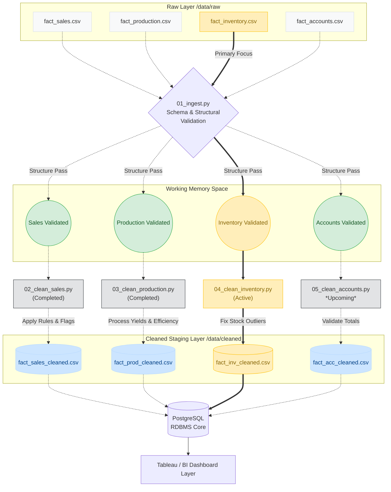

# Documentation: 04_clean_inventory.py

## Overview
`04_clean_inventory.py` acts as the **Inventory Data Cleaning Layer** of the MSRB SONS Dairy Product Pvt. Ltd. Analytics Pipeline. Its primary job is to process raw stock data (`fact_inventory.csv`) and apply strict data integrity checks, mathematical balance resolutions, and shelf-life logic to convert it into a fully trusted dataset (`fact_inventory_cleaned.csv`).

By strictly enforcing stock balance equations and tracking perishable lifespans, this script ensures the downstream dashboards accurately reflect the company's real-world inventory risks and capacities.

## Step-by-Step Data Processing

1. **Step 1: Strip Whitespaces**: Automatically targets all text columns and eliminates leading or trailing spaces to avoid hidden categorical duplication.
2. **Step 2: Date Validation**: Converts the `date` column into standard datetimes. Unparseable dates are removed. It also ensures data remains within bounds by checking against `DATE_START` and `DATE_END`.
3. **Step 3: Cast Numeric Columns**: Critical quantity fields (`opening_stock`, `received_qty`, `dispatched_qty`, `closing_stock`, `reorder_level`) are coerced into numeric types. Missing values are filled with `0`, and any impossible negative counts are clipped to `0`.
4. **Step 4: Stock Balance Equation**: Enforces the immutable rule:
   `expected_closing_stock = opening_stock + received_qty - dispatched_qty`
   If the recorded closing stock deviates from the mathematical truth, the difference is logged and the `closing_stock` is corrected cleanly algorithmically.
5. **Step 5: Dispatch Logic Capping**: Identifies illogical scenarios where `dispatched_qty` exceeds available daily stock (`opening + received`). It enforces physical reality by capping outward dispatches to the available limit, preventing negative ghost inventory.
6. **Step 6: Recalculate Stock Status**: Dynamically determines the health of the inventory based on exact daily calculations:
   - **Stockout**: When closing stock hits 0.
   - **Critical**: When closing stock is ≤ 50% of the item's reorder level.
   - **Low**: When closing stock dips below the reorder level.
   - **OK**: Stock is healthy.
7. **Step 7: Remove Duplicates**: Uses the `inventory_id` to reliably locate and remove explicitly duplicated ledger entries without losing underlying data.
8. **Step 8: Derived Columns**: Calculates and appends vital operational features:
   - Time intelligence features: `day_of_week` & Indian `financial_year`.
   - **Shelf Life Risk**: Maps each dairy product to its exact perishable logic using `SHELF_LIFE_DAYS` (e.g. Milk Packet = 3 days, Ghee = 180 days). Calculates `days_of_stock` based on dispatch burnout rates and explicitly flags items as **At Risk** or **Safe**.

---

## Data Flow Diagram

The following architectural flow maps out the lifecycle of the inventory dataset specifically, displaying its interactions with ingest boundaries across the analytical layers.

