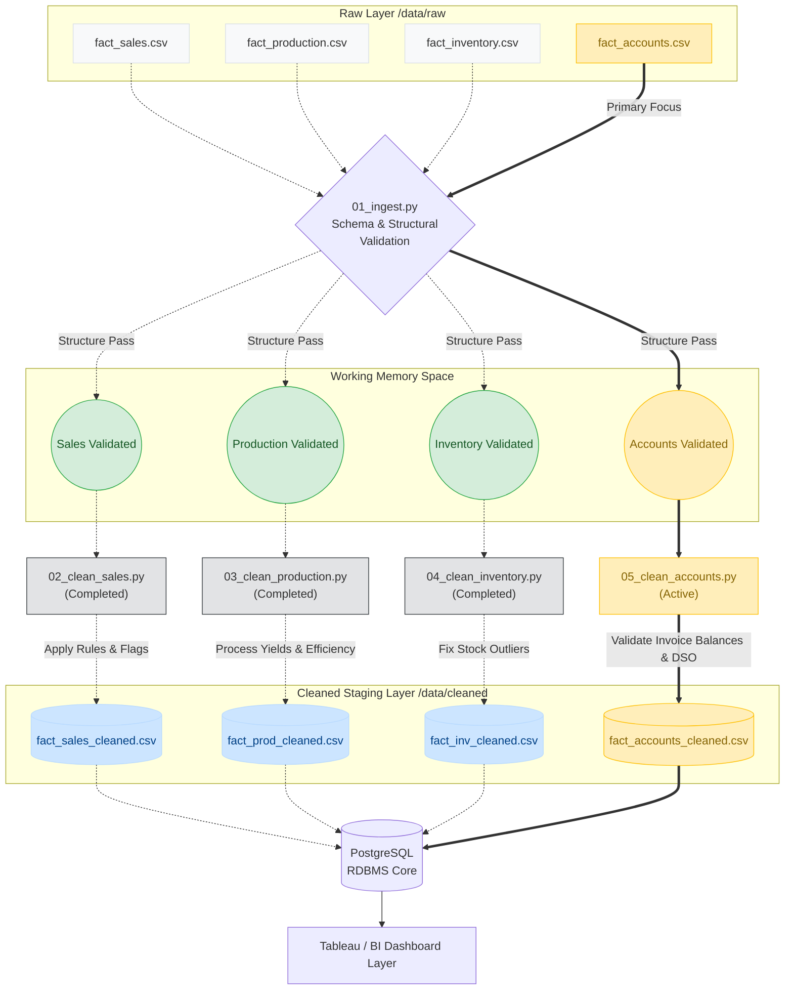

# Documentation: 05_clean_accounts.py

## Overview
`05_clean_accounts.py` acts as the **Accounts & Finance Data Cleaning Layer** of the MSRB SONS Dairy Product Pvt. Ltd. Analytics Pipeline. Its primary job is to process raw financial data (`fact_accounts.csv`) and apply strict financial integrity checks, mathematical balance resolutions, aging evaluation, and collection efficiency logic to convert it into a fully trusted dataset (`fact_accounts_cleaned.csv`).

By rigorously enforcing invoice balance equations, capping payment amounts against balances, and accurately categorizing outstanding debts, this script ensures the downstream financial reporting accurately reflects the company's real-world cash flow, outstanding obligations, and account aging risks.

## Step-by-Step Data Processing

1. **Step 1: Strip Whitespaces**: Automatically targets all text columns and eliminates leading or trailing spaces to avoid hidden categorical duplication.
2. **Step 2: Date Validation**: Converts critical date columns (`invoice_date`, `due_date`, `payment_date`) into standard datetimes. Unparseable dates are removed. Rows missing an `invoice_date` are explicitly dropped, while null `payment_date` values are intentionally retained (representing unpaid invoices). Finally, the dataset is scoped mathematically to ensure all invoices fall strictly within `DATE_START` and `DATE_END`.
3. **Step 3: Cast Numeric Columns**: Crucial monetary fields (`invoice_amount`, `amount_paid`, `outstanding_balance`, `credit_days`) are coerced into numeric types. Missing `invoice_amount` rows are discarded entirely, as they represent invalid ledger entries.
4. **Step 4: Invoice Balance Equation**: Enforces the immutable financial rule:
   `outstanding_balance = invoice_amount - amount_paid`
   If the recorded outstanding balance deviates from the mathematical truth due to manual entry errors, the algorithm recalculates and corrects the `outstanding_balance` cleanly. It also aggressively caps `amount_paid` so that it cannot exceed the source `invoice_amount`.
5. **Step 5: Cap Received Amounts**: Acts as a secondary validation where any incoming payment is capped by the currently registered `outstanding_balance`, ensuring payment logic behaves flawlessly over multiple iterations of invoice adjustments. 
6. **Step 6: Remove Duplicates**: Uses the `transaction_id` specifically to locate and remove explicitly duplicated financial transactions from being counted multiple times.
7. **Step 7: Recalculate Payment Status**: Dynamically determines the classification of all transactions:
   - **Paid**: Balance is zero and paid on or before the due date.
   - **Paid Late**: Balance is zero but paid after the due date.
   - **OverDue**: Balance remains strictly greater than zero.
8. **Step 8: Derived Columns (Aging,days_overdue, collection_efficiency & financial_year)**: Calculates and appends vital cash flow features:
   - **Financial Year**: Generates the exact Indian financial year based on `invoice_date` (April marking the start of a new FY).
   - **Days Overdue**: Tallies exactly how overdue unpaid items are compared to the analysis execution date.
   - **Aging Bucket**: Classifies the `OverDue` invoices into standardized aging brackets: `1-30 Days`, `31-60 Days`, `61-90 Days`, and `90+ Days`.
   - **Collection Efficiency**: Mathematically derives the collected proportion of an invoice's total scale logic `(amount_paid / invoice_amount) * 100`.
  

---

## Data Flow Diagram

The following architectural flow maps out the lifecycle of the accounts and finance dataset specifically, displaying its interactions with ingest boundaries across the analytical layers.

