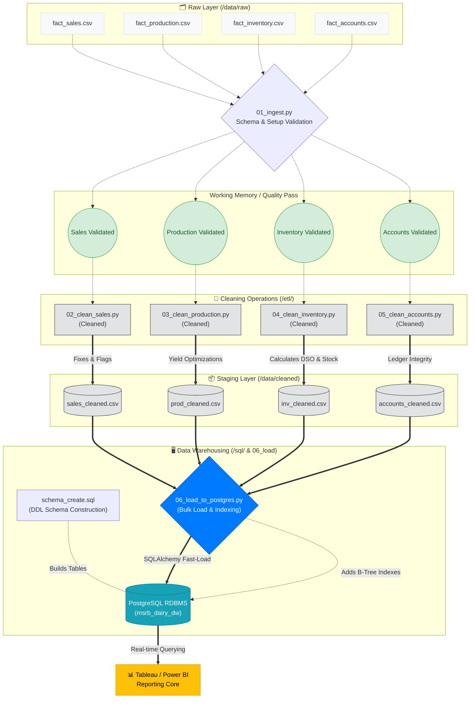

# Documentation: 06_load_to_postgres.py

## Overview
`06_load_to_postgres.py` serves as the **Data Warehousing & Load Layer** (Layer 3) of the MSRB SONS Dairy Product Pvt. Ltd. Analytics Pipeline. Its responsibility is to traverse the finalized `cleaned` directory, read all verified and transformed CSV data entities (`sales`, `production`, `inventory`, `accounts`), and seamlessly batch-upload them into the newly established PostgreSQL Star Schema data warehouse (`msrb_dairy_dw`).

By programmatically applying schema validation, column type overriding, automatic bulk insertion in chunks, and post-load index creation, this script formally moves the operational datasets from the file-based system directly to the production relational database to empower high-speed Tableau or Power BI dashboard reporting.

## Step-by-Step Data Upload Process

1. **Step 1: Database Initialization**: Leverages `SQLAlchemy` and `psycopg2` to formulate a rapid, pooled connection to the local PostgreSQL database using parameterized credentials. Tests the pipeline actively via test queries (`SELECT 1`).
2. **Step 2: Table & File Mapping**: Maps specific staging components (`fact_sales_cleaned.csv`, `fact_accounts_cleaned.csv`, etc.) cleanly to their physical SQL tables (`fact_sales`, `fact_accounts`).
3. **Step 3: Temporal Coercion (Parse Dates)**: As flat CSVs naturally lose distinct Date metadata, this script pre-parses and restores crucial timeline columns into exact `DateTime` representations prior to the SQL translation to enforce type boundaries inside PostgreSQL.
4. **Step 4: Batch Loading & Optimization**: Rather than singular `INSERT` statements which run notoriously slow, data is strategically sliced into batches (`chunk_size=5000`). It utilizes `.to_sql()`'s `'replace'` operator combined with `'multi'` indexing methods to rapidly reconstruct the data in the Postgres target structure.
5. **Step 5: Post-Load Integrity Verification**: Enforces rigorous audit testing. After bulk load, the script triggers a physical `SELECT COUNT(*)` query inside Postgres and compares those exact row counts against the originating dataframe size to ensure entirely zero data loss happened over the pipeline wire.
6. **Step 6: Query Performance Indexing**: Knowing that the Business Intelligence (BI) layer queries will heavily group data by entities, it actively creates `B-Tree Indexes` against the most frequently targeted dimensions (e.g., `date`, `product_id`, `customer_id`, `payment_status`). This aggressively scales down visualization wait times.

---

## Complete Collaborative Data Flow

Below is the **Master Architectural Flow** covering the complete 3-layer data journey — from rough inbound CSVs scattered through ingest rules, passing independent modular cleaning structures, and finally arriving together in the central PostgreSQL engine.

