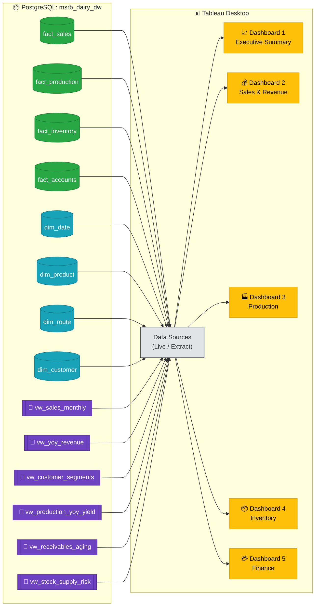

# MSRB SONS DAIRY — Tableau Dashboard Implementation Plan

**Project:** MSRB SONS DAIRY PRODUCT PVT. LTD. — Business Intelligence Dashboards  
**Author:** Pradeep Kumar  
**Data Source:** PostgreSQL `msrb_dairy_dw` (Star Schema)  
**Dashboards:** 5 Total — 1 Executive + 4 Departmental

---

## Goal

Build **5 interactive Tableau dashboards** so that the CEO, department heads, and senior executives can self-serve all critical business insights derived from the 22+ KPIs already written in SQL. Each dashboard targets a specific audience and business function.

> [!IMPORTANT]
> **Tableau cannot execute raw PostgreSQL CTE/Window-function queries directly as custom SQL in most cases.** The recommended approach is to connect Tableau **Live** to the PostgreSQL fact/dimension tables and recreate the KPI logic as **Tableau Calculated Fields**. This gives you full interactivity (filters, drill-downs) which pre-aggregated SQL views cannot.  
> However, for complex KPIs (like YoY pivots), we'll also create **PostgreSQL VIEWs** that Tableau can read directly.

---

## User Review Required

> [!IMPORTANT]
> **Decision: Tableau Desktop vs Tableau Public**  
> - **Tableau Desktop** can connect directly to PostgreSQL (Live or Extract). This is the recommended path.  
> - **Tableau Public** (free) does NOT support PostgreSQL. You'd need to export data as CSV/Excel first, then import.  
> Please confirm which version you have so I can tailor the connection steps.

> [!WARNING]
> **Your existing DAX measures (35+) were written for Power BI's tabular model.** They CANNOT be reused in Tableau. I will translate the equivalent logic into **Tableau Calculated Fields** below.

---

## Architecture Overview



---

## Phase 1: Pre-Tableau Setup (PostgreSQL Views)

We need to create **SQL VIEWs** in PostgreSQL for the complex KPIs that involve CTEs, self-joins, and pivot logic. Tableau can then read these views directly as tables.

### [NEW] [tableau_views.sql](file:///j:/python/DA_project/msrbsons_dairy_analytics/sql/tableau_views.sql)

This file will contain 6 PostgreSQL VIEWs:

| View Name | Source KPI | Purpose |
|-----------|-----------|---------|
| `vw_sales_monthly` | KPI Sales #1 | Monthly revenue time-series with MoM growth |
| `vw_yoy_revenue` | KPI Sales #6 | FY2023-24 vs FY2024-25 side-by-side |
| `vw_customer_segments` | KPI Sales #7 | Customer spend-band segmentation |
| `vw_production_yoy_yield` | KPI Prod #5 | Monthly yield pivot by year |
| `vw_receivables_aging` | KPI Acc #2 | Overdue aging bucket summary |
| `vw_stock_supply_risk` | KPI Inv #5 | Days-of-supply with risk classification |

---

## Phase 2: Tableau Data Source Setup

### Connection Steps (Tableau Desktop → PostgreSQL)

1. Open Tableau Desktop → **Connect** → **PostgreSQL**
2. Server: `localhost`, Port: `5432`, Database: `msrb_dairy_dw`
3. Authentication: Username/Password (your pgAdmin credentials)
4. Drag these tables to the canvas:

**Tables to Import:**
| Table/View | Type | Joins |
|-----------|------|-------|
| `fact_sales` | Fact | Left join to dim_date, dim_product, dim_route, dim_customer |
| `fact_production` | Fact | Left join to dim_date |
| `fact_inventory` | Fact | Left join to dim_date, dim_product |
| `fact_accounts` | Fact | Left join to dim_date, dim_customer |
| `dim_date` | Dimension | Central date spine |
| `dim_product` | Dimension | Product attributes |
| `dim_route` | Dimension | Route geography |
| `dim_customer` | Dimension | Customer master |
| `vw_sales_monthly` | View | Standalone |
| `vw_yoy_revenue` | View | Standalone |
| `vw_customer_segments` | View | Standalone |
| `vw_production_yoy_yield` | View | Standalone |
| `vw_receivables_aging` | View | Standalone |
| `vw_stock_supply_risk` | View | Standalone |

### Relationship Model in Tableau

```
dim_date ─── fact_sales       (date_key = date)
dim_date ─── fact_production  (date_key = date)
dim_date ─── fact_inventory   (date_key = date)
dim_date ─── fact_accounts    (date_key = invoice_date)

dim_product ─── fact_sales      (product_id)
dim_product ─── fact_inventory  (product_id)

dim_route ─── fact_sales (route_id)

dim_customer ─── fact_sales    (customer_id)  -- optional, limited use
dim_customer ─── fact_accounts (customer_id)
```

---

## Phase 3: Tableau Calculated Fields

These replace the DAX measures. Create these in Tableau under **Analysis → Create Calculated Field**.

### Sales Calculated Fields
```
// Total Revenue
SUM([Net Amount])

// Total Gross Revenue
SUM([Gross Amount])

// Total Discount
SUM([Discount])

// Discount %
SUM([Discount]) / SUM([Gross Amount]) * 100

// Average Invoice Value
SUM([Net Amount]) / COUNTD([Invoice Number])

// Total Unique Customers
COUNTD([Customer Id])

// Revenue Share % (Table Calc)
SUM([Net Amount]) / TOTAL(SUM([Net Amount])) * 100
```

### Production Calculated Fields
```
// Production Efficiency %
SUM([Actual Qty]) / SUM([Planned Qty]) * 100

// Wastage Rate %
SUM([Wastage Qty]) / SUM([Actual Qty]) * 100

// Yield Efficiency %
SUM([Net Produced Qty]) / SUM([Raw Milk Used L]) * 100

// Efficiency vs Target
(SUM([Actual Qty]) / SUM([Planned Qty]) * 100) - 95
```

### Inventory Calculated Fields
```
// Stockout Days Count
COUNTD(IF [Stock Status] = "Stockout" THEN [Date] END)

// Stockout Rate %
COUNTD(IF [Stock Status] = "Stockout" THEN [Date] END) / COUNTD([Date]) * 100

// Average Inventory
(SUM([Opening Stock]) + SUM([Closing Stock])) / 2

// Turnover Ratio
SUM([Dispatched Qty]) / ((SUM([Opening Stock]) + SUM([Closing Stock])) / 2)
```

### Accounts Calculated Fields
```
// Collection Efficiency %
SUM([Amount Paid]) / SUM([Invoice Amount]) * 100

// DSO (Days Sales Outstanding)
(SUM([Outstanding Balance]) * 30) / SUM([Invoice Amount])

// Overdue Amount
SUM(IF [Payment Status] = "OverDue" THEN [Outstanding Balance] END)

// 90+ Day Overdue
SUM(IF [Aging Bucket] = "90+ Days" THEN [Outstanding Balance] END)
```

---

## Phase 4: Dashboard Specifications

---

### 📊 DASHBOARD 1: Executive Summary (CEO View)

**Audience:** CEO, Board, Investors  
**Purpose:** Single-page health check across all 4 departments  
**Size:** 1920 × 1080 (Automatic / Fixed)

#### Layout Wireframe
```
┌─────────────────────────────────────────────────────────────────┐
│  MSRB SONS DAIRY — EXECUTIVE DASHBOARD          [FY▼] [Month▼]│
├────────────┬────────────┬────────────┬────────────┬─────────────┤
│ 💰 Revenue │  📈 MoM %  │ ⚙️ Eff %  │ 📦 Stockout│ 💳 Coll %  │
│   ₹4.2Cr   │   +3.2%    │   93.4%    │    8.3%    │   86.4%    │
│  (KPI Card)│ (KPI Card) │ (KPI Card) │ (KPI Card) │ (KPI Card) │
├────────────┴────────────┴────────────┴────────────┴─────────────┤
│                                                                 │
│   📈 Monthly Revenue Trend (Area Chart — 24 months)             │
│   with YoY comparison overlay                                   │
│                                                                 │
├─────────────────────────────┬───────────────────────────────────┤
│                             │                                   │
│  🍰 Revenue by Category    │  ⚠️ Receivables Aging Breakdown   │
│     (Donut / Treemap)       │     (Stacked Bar)                 │
│                             │                                   │
├─────────────────────────────┼───────────────────────────────────┤
│                             │                                   │
│  🏭 Production Efficiency   │  📦 Stock Status Distribution     │
│     vs 95% Target (Bullet)  │     (Horizontal Bar)              │
│                             │                                   │
└─────────────────────────────┴───────────────────────────────────┘
```

#### Sheets Required (7 sheets → 1 dashboard)

| # | Sheet Name | Chart Type | Data Source | KPI Reference |
|---|-----------|------------|-------------|---------------|
| 1 | `KPI_Revenue_Card` | Text/BAN | fact_sales | Total Net Revenue |
| 2 | `KPI_MoM_Card` | Text/BAN | vw_sales_monthly | Latest MoM % |
| 3 | `KPI_Efficiency_Card` | Text/BAN | fact_production | Avg Efficiency % |
| 4 | `KPI_Stockout_Card` | Text/BAN | fact_inventory | Stockout Rate % |
| 5 | `KPI_Collection_Card` | Text/BAN | fact_accounts | Collection Efficiency % |
| 6 | `Monthly_Revenue_Trend` | Dual-Axis Area+Line | vw_sales_monthly | KPI Sales #1 |
| 7 | `Revenue_By_Category` | Treemap / Donut | fact_sales | KPI Sales #2 |
| 8 | `Receivables_Aging` | Stacked Bar | vw_receivables_aging | KPI Acc #2 |
| 9 | `Production_vs_Target` | Bullet Chart | fact_production | KPI Prod #1 |
| 10 | `Stock_Status_Dist` | Horizontal Bar | fact_inventory | KPI Inv #1 |

#### Filters (Global)
- **Financial Year** — Quick Filter (dropdown)
- **Month** — Quick Filter (slider or dropdown)

---

### 💰 DASHBOARD 2: Sales & Revenue

**Audience:** Sales Head, Route Managers, CEO  
**Purpose:** Deep-dive into sales performance, customer behavior, and route efficiency  
**KPIs Covered:** Sales KPI 1–7

#### Layout Wireframe
```
┌──────────────────────────────────────────────────────────────────┐
│  SALES & REVENUE DASHBOARD                [FY▼] [Quarter▼] [Cat▼]│
├───────────┬───────────┬───────────┬───────────┬──────────────────┤
│💰Revenue  │📋Invoices │👥Customers│🎯Avg Order│  📉 Discount %  │
│  ₹4.2Cr   │   12,400  │    120    │   ₹3,400  │     2.8%         │
├───────────┴───────────┴───────────┴───────────┴──────────────────┤
│                                                                  │
│  📈 Monthly Revenue Trend with MoM Growth % (Combo Chart)        │
│     Bars = Revenue, Line = MoM %                                 │
│                                                                  │
├──────────────────────────────┬───────────────────────────────────┤
│                              │                                   │
│  🍰 Revenue by Category     │  📊 YoY Revenue Comparison        │
│     (Treemap with % labels)  │     (Grouped Bar: FY23 vs FY24)   │
│                              │                                   │
├──────────────────────────────┼───────────────────────────────────┤
│                              │                                   │
│  🚚 Route Performance       │  💳 Payment Mode Distribution     │
│     (Map or Horizontal Bar)  │     (Pie / Donut Chart)           │
│                              │                                   │
├──────────────────────────────┴───────────────────────────────────┤
│                                                                  │
│  👥 Top 20 Customers Table  + 🏅 Customer Segmentation (Bar)    │
│                                                                  │
└──────────────────────────────────────────────────────────────────┘
```

#### Sheets Required (10 sheets → 1 dashboard)

| # | Sheet Name | Chart Type | KPI |
|---|-----------|------------|-----|
| 1 | `Sales_KPI_Cards` | BAN (5 cards) | Summary metrics |
| 2 | `Monthly_Revenue_Bars` | Bar+Line Combo | KPI #1 |
| 3 | `Category_Treemap` | Treemap | KPI #2 |
| 4 | `YoY_Comparison` | Grouped Bar | KPI #6 |
| 5 | `Route_Performance` | Horizontal Bar | KPI #3 |
| 6 | `Payment_Mode_Pie` | Donut/Pie | KPI #5 |
| 7 | `Top_20_Customers` | Highlight Table / Crosstab | KPI #4 |
| 8 | `Customer_Segmentation` | Stacked Bar | KPI #7 |

#### Filters (Global via Dashboard Action)
- Financial Year, Quarter, Month
- Category (Product)
- Route Name
- Customer Type
- Payment Mode

---

### 🏭 DASHBOARD 3: Production & Operations

**Audience:** Production Head, Plant Manager, CEO  
**Purpose:** Monitor factory efficiency, wastage, shift performance, and raw material yield  
**KPIs Covered:** Production KPI 1–5

#### Layout Wireframe
```
┌──────────────────────────────────────────────────────────────────┐
│  PRODUCTION & OPERATIONS DASHBOARD        [FY▼] [Category▼]     │
├───────────┬───────────┬───────────┬──────────────────────────────┤
│⚙️ Eff %   │🗑️Wastage% │🥛Milk (L) │  🎯 Efficiency vs Target    │
│  93.4%    │   2.1%    │  240K L   │    ❌ -1.6% Below 95%         │
├───────────┴───────────┴───────────┴──────────────────────────────┤
│                                                                  │
│  📈 Monthly Efficiency Trend (Line Chart with 95% Reference)     │
│     + Wastage Rate on secondary axis                             │
│                                                                  │
├──────────────────────────────┬───────────────────────────────────┤
│                              │                                   │
│  🧀 Category Efficiency      │  🔄 YoY Yield Trend by Category  │
│     (Horizontal Bar with     │     (Heatmap / Highlight Table)   │
│      color by efficiency)    │                                   │
├──────────────────────────────┼───────────────────────────────────┤
│                              │                                   │
│  🔔 Efficiency Band Dist.   │  ☀️🌙 Shift Performance           │
│     (Pie or Donut)           │     (Side-by-side Bar)            │
│                              │                                   │
├──────────────────────────────┴───────────────────────────────────┤
│                                                                  │
│  🥛 Monthly Raw Milk Utilization vs Net Produced (Area Chart)    │
│                                                                  │
└──────────────────────────────────────────────────────────────────┘
```

#### Sheets Required (8 sheets → 1 dashboard)

| # | Sheet Name | Chart Type | KPI |
|---|-----------|------------|-----|
| 1 | `Prod_KPI_Cards` | BAN (4 cards) | Summary metrics |
| 2 | `Monthly_Efficiency_Trend` | Dual-Axis Line | KPI #1 |
| 3 | `Category_Efficiency_Bar` | Horizontal Bar | KPI #2 (base) |
| 4 | `YoY_Yield_Heatmap` | Highlight Table | KPI #2 (pivot) |
| 5 | `Efficiency_Band_Donut` | Donut/Pie | KPI #3 |
| 6 | `Shift_Performance_Bar` | Grouped Bar | KPI #4 |
| 7 | `Milk_Utilization_Area` | Area Chart | KPI #5 |

#### Filters
- Financial Year, Quarter
- Category (Milk Bulk, Paneer, Ghee, etc.)
- Shift (Morning / Evening)

---

### 📦 DASHBOARD 4: Inventory & Supply Chain

**Audience:** Inventory Manager, Supply Chain Head, CEO  
**Purpose:** Monitor stock health, stockout risks, shelf-life expiry, and product movement velocity  
**KPIs Covered:** Inventory KPI 1–5

#### Layout Wireframe
```
┌──────────────────────────────────────────────────────────────────┐
│  INVENTORY & SUPPLY CHAIN DASHBOARD       [Date▼] [Category▼]   │
├───────────┬───────────┬───────────┬──────────────────────────────┤
│📦 Closing │🚫Stockout%│⚠️ AtRisk  │  🔄 Avg Turnover Ratio      │
│  Stock    │   8.3%    │ Products  │       6.2x                   │
├───────────┴───────────┴───────────┴──────────────────────────────┤
│                                                                  │
│  📊 Current Stock Status Table (Conditional formatting)          │
│     Product | Closing | Reorder | Status | Shelf Risk | DoS     │
│     Color: Green=OK, Yellow=Low, Orange=Critical, Red=Stockout   │
│                                                                  │
├──────────────────────────────┬───────────────────────────────────┤
│                              │                                   │
│  🚫 Stockout Frequency      │  🧮 Shelf Life Risk Summary       │
│     by Product               │     by Category                   │
│     (Horizontal Bar,         │     (Stacked 100% Bar)            │
│      color by risk)          │                                   │
├──────────────────────────────┼───────────────────────────────────┤
│                              │                                   │
│  📈 Monthly Turnover Ratio  │  ⏳ Days of Supply Remaining      │
│     (Line Chart by Product)  │     (Bullet or Lollipop Chart)    │
│                              │                                   │
└──────────────────────────────┴───────────────────────────────────┘
```

#### Sheets Required (7 sheets → 1 dashboard)

| # | Sheet Name | Chart Type | KPI |
|---|-----------|------------|-----|
| 1 | `Inv_KPI_Cards` | BAN (4 cards) | Summary metrics |
| 2 | `Current_Stock_Table` | Highlight Table | KPI #1 |
| 3 | `Stockout_Frequency` | Horizontal Bar | KPI #2 |
| 4 | `Monthly_Turnover` | Line Chart | KPI #3 |
| 5 | `Shelf_Life_Risk` | Stacked 100% Bar | KPI #4 |
| 6 | `Days_Supply_Remaining` | Bullet/Lollipop | KPI #5 |

#### Filters
- Date (Latest / Custom)
- Category
- Product
- Stock Status

---

### 💳 DASHBOARD 5: Accounts & Finance

**Audience:** Finance Head, Accounts Manager, CEO  
**Purpose:** Track billing health, collection efficiency, overdue aging, and customer payment behavior  
**KPIs Covered:** Accounts KPI 1–5

#### Layout Wireframe
```
┌──────────────────────────────────────────────────────────────────┐
│  ACCOUNTS & FINANCE DASHBOARD             [FY▼] [CustomerType▼] │
├───────────┬───────────┬───────────┬───────────┬──────────────────┤
│💰 Billed  │✅Collected│⚠️Outstand.│📅 DSO     │  💳 Coll %      │
│  ₹4.8Cr   │  ₹4.1Cr  │  ₹0.7Cr  │  14.2 d   │   86.4%          │
├───────────┴───────────┴───────────┴───────────┴──────────────────┤
│                                                                  │
│  📈 Monthly Billing vs Collections (Combo: Bar + Line)           │
│     Bars = Billed & Collected, Line = Collection Efficiency %    │
│                                                                  │
├──────────────────────────────┬───────────────────────────────────┤
│                              │                                   │
│  📊 Receivables Aging        │  📅 DSO Trend by Month            │
│     Buckets (Stacked Bar)    │     (Line Chart with threshold)   │
│     1-30d, 31-60d, 61-90d,  │                                   │
│     90+d                     │                                   │
├──────────────────────────────┼───────────────────────────────────┤
│                              │                                   │
│  👥 Customer Payment         │  🏢 Customer Type Efficiency      │
│     Behavior Table           │     (Grouped Bar)                 │
│     (Scrollable, top 20)     │                                   │
│                              │                                   │
└──────────────────────────────┴───────────────────────────────────┘
```

#### Sheets Required (8 sheets → 1 dashboard)

| # | Sheet Name | Chart Type | KPI |
|---|-----------|------------|-----|
| 1 | `Acc_KPI_Cards` | BAN (5 cards) | Summary metrics |
| 2 | `Billing_vs_Collections` | Bar+Line Combo | KPI #1 |
| 3 | `Aging_Buckets` | Stacked Bar | KPI #2 |
| 4 | `Customer_Payment_Table` | Highlight Table | KPI #3 |
| 5 | `DSO_Trend` | Line Chart | KPI #4 |
| 6 | `CustType_Efficiency` | Grouped Bar | KPI #5 |

#### Filters
- Financial Year
- Customer Type (Retailer, Wholesaler, Hotel, Institutional)
- Payment Status

---

## Phase 5: Interactivity & Navigation

### Global Interactivity Rules

| Feature | Implementation |
|---------|---------------|
| **Cross-Dashboard Navigation** | Navigation buttons at top of each dashboard linking to all 5 dashboards |
| **Filter Actions** | Click on any chart element → filters all other sheets on same dashboard |
| **Highlight Actions** | Hover on category/route → highlights matching data across charts |
| **URL Actions** | Drill from Executive → Departmental dashboards |
| **Tooltip Customization** | Viz-in-Tooltip for key charts (e.g., hover on month → see category breakdown) |
| **Parameter Actions** | Top N slicer for customer/product rankings |

### Color Palette (Consistent Across All Dashboards)

| Element | Color | Hex |
|---------|-------|-----|
| Primary (Revenue) | Dark Teal | `#17a2b8` |
| Success (On Target) | Green | `#28a745` |
| Warning (Below Target) | Amber | `#ffc107` |
| Danger (Critical) | Red | `#dc3545` |
| Background | Dark Navy | `#1e2a3a` |
| Card Background | Slate | `#2d3748` |
| Text Primary | White | `#ffffff` |
| Text Secondary | Light Gray | `#a0aec0` |

---

## Proposed Changes

### PostgreSQL Layer

#### [NEW] [tableau_views.sql](file:///j:/python/DA_project/msrbsons_dairy_analytics/sql/tableau_views.sql)
- 6 PostgreSQL VIEWs encoding the complex KPI logic (CTEs, pivots, self-joins)
- Must be run in pgAdmin before connecting Tableau

---

### Documentation Layer

#### [NEW] [tableau_dashboard_guide.md](file:///j:/python/DA_project/msrbsons_dairy_analytics/docs/tableau_dashboard_guide.md)
- Step-by-step Tableau build guide with screenshots milestones
- Calculated field definitions copy-paste ready
- Dashboard formatting instructions

---

### Dashboard Layer

#### [NEW] Tableau Workbook (manual creation in Tableau Desktop)
- 5 Dashboards × ~8 sheets each = ~40 Tableau sheets
- Saved as `dashboards/msrb_dairy_dashboards.twbx`

---

## Open Questions

> [!IMPORTANT]
> **1. Tableau Version:** Do you have **Tableau Desktop** (paid) or **Tableau Public** (free)?  
> - Desktop → Direct PostgreSQL connection (best option)  
> - Public → I'll generate export scripts to create CSV files from each view, then you import those into Tableau Public

> [!IMPORTANT]
> **2. Deployment:** Will these dashboards be:  
> - **a)** Published to Tableau Server / Tableau Cloud for team access?  
> - **b)** Shared as `.twbx` packaged workbook files?  
> - **c)** Exported as PDFs/images for presentations?

> [!NOTE]
> **3. Branding:** Would you like to include the MSRB SONS company logo in the dashboard headers? If yes, please provide the logo image file.

---

## Verification Plan

### Automated Tests
- Run each PostgreSQL VIEW and verify row counts match expected KPI outputs
- Cross-verify 5 key metric values between SQL output and Tableau cards:
  - Total Revenue = ₹4.2Cr+
  - Production Efficiency = ~93.4%
  - Stockout Rate = ~8.3%
  - Collection Efficiency = ~86.4%
  - DSO = ~14.2 days

### Manual Verification
- Verify each Tableau filter properly cascades across all sheets
- Test navigation between dashboards
- Validate tooltip accuracy
- Check responsive behavior at 1920×1080 and 1366×768 resolutions

---

## Execution Timeline

| Step | Deliverable | Est. Time |
|------|------------|-----------|
| 1 | Create `tableau_views.sql` + run in pgAdmin | 30 min |
| 2 | Create `tableau_dashboard_guide.md` | 45 min |
| 3 | Build Dashboard 1: Executive Summary | Manual in Tableau |
| 4 | Build Dashboard 2: Sales & Revenue | Manual in Tableau |
| 5 | Build Dashboard 3: Production | Manual in Tableau |
| 6 | Build Dashboard 4: Inventory | Manual in Tableau |
| 7 | Build Dashboard 5: Accounts & Finance | Manual in Tableau |
| 8 | Cross-verify KPI values | 20 min |
