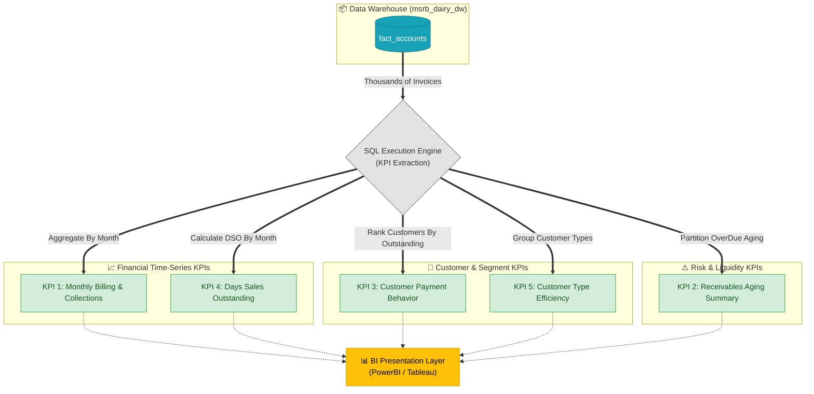

# Documentation: kpi_accounts.sql

## Overview
`kpi_accounts.sql` represents the **Business Intelligence & Presentation Layer** of the MSRB SONS Dairy Product Pvt. Ltd. Analytics Pipeline focusing on financial, cash-flow, and receivables operations. Executing against the finalized `msrb_dairy_dw` Data Warehouse, this script houses 5 primary SQL queries crafted to answer critical business questions regarding monthly billings, collection efficiency, overdue aging buckets, and customer payment behavior.

These KPIs act as the core mathematical foundation that will visually power the downstream Tableau / Power BI Dashboards to track daily financial health.

## KPI Query Breakdown

### KPI 1: Monthly Billing vs Collections
- **Business Question**: *How much did we bill, how much was collected, and what is our overall collection efficiency month-over-month?*
- **Metrics Calculated**: Customers billed, total billed amount, total collected amount, total outstanding balance, and collection efficiency percentage.
- **Grouping**: Grouped sequentially by `year`, `month`, `month_name`, `quarter`, and `financial_year` for clear financial time-series plotting.

### KPI 2: Receivables Aging Summary
- **Business Question**: *What is the breakdown of our overdue payments by age? How much cash is stuck in >90 day buckets?*
- **Metrics Calculated**: Count of invoices, count of unique customers, total outstanding amount, and the percentage share of each aging bucket using Window Functions.
- **Grouping**: Segmented by `aging_bucket` and strictly filtered to show only `payment_status='OverDue'`. Sorted chronologically by age bucket.

### KPI 3: Customer Payment Behaviour
- **Business Question**: *Which specific customers hold the highest outstanding balances? What is their payment habit (on time vs late vs overdue)?*
- **Metrics Calculated**: Total invoices, total billed, total paid, total outstanding, average days to pay, categorised payment counts (on time, paid late, overdue), and individual collection efficiency.
- **Grouping**: Aggregated per `customer_id`, `customer_name`, and `customer_type`.

### KPI 4: Days Sales Outstanding (DSO) by Month
- **Business Question**: *How many days on average does it take to collect payment after a sale is made each month?*
- **Metrics Calculated**: DSO (Days Sales Outstanding) formulated as overall outstanding balance multiplied by 30 days divided by total invoiced amount per month.
- **Grouping**: Grouped sequentially by `year` and `month`.

### KPI 5: Customer Type Collection Efficiency
- **Business Question**: *Which customer segment (e.g., Retailer vs Distributor vs Direct) is the most reliable at paying?*
- **Metrics Calculated**: Unique customers, invoice count, total billed, total collected, outstanding balance, overall collection efficiency percentage, and average days to pay.
- **Grouping**: Grouped cleanly by `customer_type`.

---

## Analytics Execution Flow

Below maps how these SQL queries extract and aggregate the raw table rows into dense business intelligence values.

