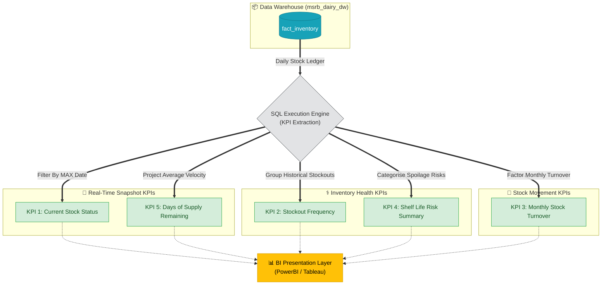

# Documentation: kpi_inventory.sql

## Overview
`kpi_inventory.sql` represents the **Business Intelligence & Presentation Layer** of the MSRB SONS Dairy Product Pvt. Ltd. Analytics Pipeline focusing on supply chain and warehouse management. Executing against the finalized `msrb_dairy_dw` Data Warehouse, this script houses 5 primary SQL queries crafted to answer critical business questions regarding daily stock tracking, product movement velocity, shelf-life expiry risks, and stockout frequency.

These KPIs act as the core mathematical foundation that will visually power the downstream Tableau / Power BI Dashboards to track daily inventory health.

## KPI Query Breakdown

### KPI 1: Current Stock Status (Latest Date)
- **Business Question**: *What is the most recent snapshot of our warehouse? Which products are currently OK, Low, Critical, or Stocked out?*
- **Metrics Calculated**: Closing stock, reorder level, dynamic stock status, shelf-life risk flag, and current days of stock available.
- **Grouping**: Fetches precisely the rows corresponding to the absolute latest recorded date via a subquery.

### KPI 2: Stockout Frequency by Product
- **Business Question**: *Over the historical timeframe, which products consistently hit zero stock or critical levels most frequently?*
- **Metrics Calculated**: Total tracked days, absolute count of total stockout days, critical days, overall stockout rate percentage, and an aggregated risk categorisation (High/Medium/Low/No Risk).
- **Grouping**: Grouped per `product_id` and `category`, utilizing a CTE to cleanly separate the aggregation mechanics from the final risk classification logic.

### KPI 3: Monthly Stock Turnover
- **Business Question**: *Which months and products signify fast-moving inventory versus lingering dead stock?*
- **Metrics Calculated**: Average inventory (Opening + Closing / 2), total dispatched quantity, turnover ratio, and a dynamically mapped `movement_category` (Fast Moving / Normal / Slow / Dead).
- **Grouping**: Segments sequentially by `year`, `month`, and individually per `product_id` utilizing a CTE.

### KPI 4: Shelf Life Risk Summary
- **Business Question**: *Across our product categories, how much of our inventory is currently risking expiry versus remaining entirely safe?*
- **Metrics Calculated**: Total absolute records representing each shelf life state and its percentage share against that specific category.
- **Grouping**: Partitioned natively by `category` and its correlated `shelf_life_risk` tracking.

### KPI 5: Days of Stock Remaining by Product
- **Business Question**: *According to average historical dispatch rates, exactly how many days of supply are left for each product? Will existing inventory expire before selling?*
- **Implementation**: Utilizes two dedicated CTEs (`current_stock` & `avg_dispatch`) merged accurately to model the predictive lifespan of stock.
- **Metrics Calculated**: Average daily dispatch, dynamically projected `days_of_stock_remaining`, and a finalized predictive `supply_risk` classification spanning from 'Stockout' & 'Critical' to 'At Risk - Expires Before Sold'.

---

## Analytics Execution Flow

Below maps how these SQL queries extract and aggregate the raw table rows into dense business intelligence values.

