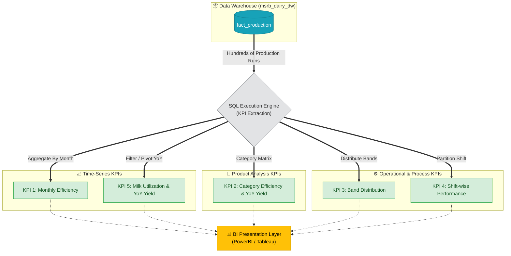

# Documentation: kpi_production.sql

## Overview
`kpi_production.sql` represents the **Business Intelligence & Presentation Layer** of the MSRB SONS Dairy Product Pvt. Ltd. Analytics Pipeline focusing on manufacturing and operations operations. Executing against the finalized `msrb_dairy_dw` Data Warehouse, this script houses 5 primary SQL queries (along with advanced pivot logic) crafted to answer critical business questions regarding production volumes, factory efficiency bands, product yield factors, and shift operational performance.

These KPIs act as the core mathematical foundation that will visually power the downstream Tableau / Power BI Dashboards to track daily factory operations.

## KPI Query Breakdown

### KPI 1: Monthly Production Efficiency
- **Business Question**: *What is our overall production efficiency and wastage rate month over month?*
- **Metrics Calculated**: Total planned quantity, total actual quantity, total wastage, total raw milk used, overall efficiency percentage (aggregate SUMs calculation), and overall wastage percentage.
- **Grouping**: Grouped sequentially by `year`, `month`, `month_name`, `quarter`, and `financial_year` for time-series plotting.

### KPI 2: Efficiency by Product Category
- **Business Question**: *Which product categories boast the highest or lowest yield and efficiency? What is the trend of product yield year-over-year?*
- **Implementation**: Utilizes Common Table Expressions (CTEs) and conditional aggregation (simulated PIVOT) to transpose yearly yield margins side-by-side.
- **Metrics Calculated**: Efficiency percentage (SUM/SUM), wastage percentage (SUM/SUM), total milk utilized, base yield percentage, and year-by-year Yield Trends (`year_23`, `year_24`, `year_25`).
- **Grouping**: Segments the data exactly by `category` (e.g., Milk Packet, Paneer, Ghee).

### KPI 3: Efficiency Band Distribution
- **Business Question**: *How many of our distinct production runs fall into Poor, Fair, or Good efficiency bands?*
- **Metrics Calculated**: Count of distinct production runs and the percentage share of each band relative to the whole.
- **Grouping**: Grouped directly by predefined `efficiency_band` attributes (e.g., Fair 90-95%, Poor 85-90%, Good 95-100%).

### KPI 4: Shift-wise Performance
- **Business Question**: *Which operational shift (Morning vs Evening) achieves a higher aggregate efficiency and produces more total goods?*
- **Metrics Calculated**: Total production runs, average efficiency percentage (calculated via aggregated SUM/SUM actuals vs planned), average wastage percentage, net goods produced, and total production share percentage.
- **Grouping**: Grouped cleanly by `shift`.

### KPI 5: Monthly Raw Milk Utilization
- **Business Question**: *How is our raw milk utilization translating into net produced goods? How stable is our aggregate yield efficiency across the fiscal year and YoY?*
- **Implementation**: Employs CTEs and an emulated PIVOT via `MAX(CASE WHEN...)` logic, tracking the yield efficiency percentage flat alongside the three recorded years. Missing years use `NULL` instead of `0` to accurately reflect absence of production data.
- **Metrics Calculated**: Total raw milk utilized, net produced volume, aggregate yield efficiency percentage, mapped temporally per month across 2023, 2024, and 2025.
- **Grouping**: Grouped sequentially by `month` and `month_name`.

---

## Analytics Execution Flow

Below maps how these SQL queries extract and aggregate the raw table rows into dense business intelligence values.

