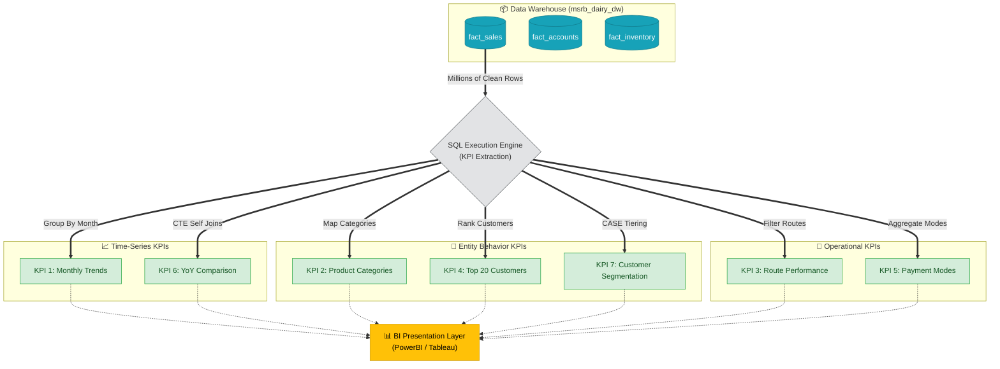

# Documentation: kpi_sales.sql

## Overview
`kpi_sales.sql` represents the **Business Intelligence & Presentation Layer** of the MSRB SONS Dairy Product Pvt. Ltd. Analytics Pipeline. Executing against the finalized `msrb_dairy_dw` Data Warehouse, this script houses 7 primary SQL queries crafted to answer critical business questions regarding top-line revenue, product profitability, customer behavior, and regional delivery performance.

These KPIs act as the core mathematical foundation that will visually power the downstream Tableau / Power BI Dashboards.

## KPI Query Breakdown

### KPI 1: Monthly Revenue Trend
- **Business Question**: *How much revenue did we earn each month, and what was the growth month over month?*
- **Metrics Calculated**: Total invoices, unique customers, gross revenue, net revenue, average invoice value, and percentage of discount given.
- **Grouping**: Grouped sequentially by `year`, `month`, and `financial_year` for clear time-series plotting.

### KPI 2: Revenue by Product Category
- **Business Question**: *Which product categories drive the most revenue? What is each category's share of total revenue?*
- **Metrics Calculated**: Total quantity sold, net revenue, revenue share percentage (via Window functions), average unit price, and average discount.
- **Grouping**: Segments the data exactly by `category` (e.g., Milk, Butter, Ghee) and sorts by the highest revenue generators.

### KPI 3: Route Performance
- **Business Question**: *Which delivery routes generate the most revenue? How many customers does each route serve?*
- **Metrics Calculated**: Customers served per route, revenue per customer, average invoice value, and overall route revenue share percentage.
- **Grouping**: Groups the geographical performance strictly by `route_id` and `route_name`.

### KPI 4: Top 20 Customers by Revenue
- **Business Question**: *Who are our top 20 customers? When did they first buy from us? When did they last buy?*
- **Metrics Calculated**: Lifetime revenue, average invoice value, `first_purchase` date, `last_purchase` date, and total active purchasing days.
- **Grouping**: Aggregated per `customer_id` and `customer_name`, bounded rigidly by a `LIMIT 20`.

### KPI 5: Payment Mode Analysis
- **Business Question**: *What percentage of our transactions are Cash vs Credit vs UPI vs Cheque? Does payment mode affect average order value?*
- **Metrics Calculated**: Total transaction count, transaction share percentage, revenue share percentage, and average transaction value.
- **Grouping**: Grouped directly by `payment_mode` to understand cash-flow stability and liquidity streams.

### KPI 6: Year-over-Year Revenue Comparison
- **Business Question**: *How does a single month's revenue perform when compared to the precise same month in the prior financial year?*
- **Implementation**: Utilizes Common Table Expressions (CTEs) and Self-Joins to lay FY2023-24 flat alongside FY2024-25.
- **Metrics Calculated**: Absolute revenue change and exact Year-over-Year (YoY) Growth Percentage string.

### KPI 7: Customer Segmentation by Spend Band
- **Business Question**: *How healthy is our customer portfolio based on spending tiers?*
- **Implementation**: Computes individual customer revenue, then uses a SQL `CASE` statement to bucket them into logical tiers.
- **Tiers Executed**: 
  - `Platinum (>=9L)`
  - `Gold (8.5L-9L)`
  - `Silver (7.5L-8.5L)`
  - `Bronze (6.5L-7.5L)`
  - `Standard (<6L)`
- **Metrics Calculated**: Headcount per segment, total segment revenue, average customer revenue within the tier, and total revenue share percentage.

---

## Analytics Execution Flow

Below maps how these SQL queries extract and aggregate the raw table rows into dense business intelligence values.

