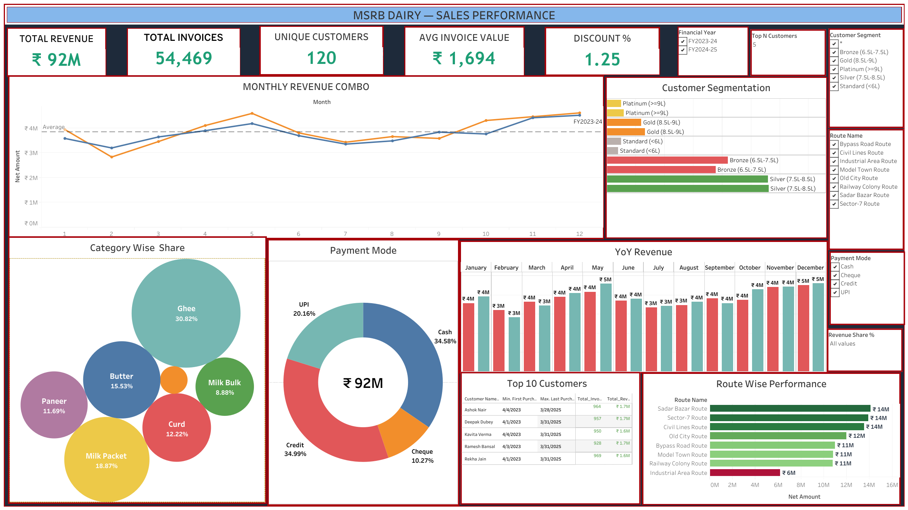

# Sales Performance Dashboard Report

**Project:** MSRB SONS DAIRY Business Analytics  
**Dashboard:** Sales & Revenue Performance  
**Date:** April 10, 2026  
**Live Link:** [Tableau Public - MSRB Sales Performance](https://public.tableau.com/shared/NBH9N4P4F?:display_count=n&:origin=viz_share_link)

---

## Dashboard Overview

This dashboard provides a comprehensive overview of the sales operations for MSRB SONS DAIRY over two financial years (FY 2023-24 and FY 2024-25). It tracks revenue trends, customer segments, route performance, and product category distribution.

---

## Key Performance Indicators (KPIs)

| Metric | Value | Business Context |
|--------|-------|------------------|
| **Total Revenue** | **₹ 92M** | Net revenue generated over 24 months. |
| **Total Invoices** | **54,469** | High transaction volume reflecting consistent retail/wholesale activity. |
| **Unique Customers** | **120** | Stable customer base across 8 delivery routes. |
| **Avg Invoice Value** | **₹ 1,694** | Indicates a mix of small retail orders and larger wholesale dispatches. |
| **Discount %** | **1.25%** | Lean discounting strategy to maintain healthy margins. |

---

## Functional Insights

### 1. Category Wise Share (Product Performance)
- **Ghee** is the dominant revenue driver, accounting for **30.82%** of total sales.
- **Milk Packets (18.87%)** and **Butter (15.53%)** follow closely.
- Perishables (Curd, Milk Bulk, Paneer) combined account for approximately **33%** of revenue, requiring careful inventory turnover management.

### 2. Route Wise Performance
- **Sadar Bazar Route** and **Sector-7 Route** are the primary revenue hubs, both generating ~₹ 14M.
- **Industrial Area Route** shows the lowest revenue contribution, suggesting a potential for growth or route optimization.

### 3. Payment Mode Analysis
- **Cash (34.58%)** and **Credit (34.99%)** are equally used, showing that the dairy operates heavily on traditional credit terms.
- **UPI (20.16%)** adoption is significant, providing faster liquidity than Cheque (10.27%).

### 4. Revenue Trends (Monthly Combo)
- Clear seasonality is visible, with revenue peaks typically occurring in the latter half of the year (Festive Season).
- FY 2024-25 shows stable growth compared to the previous year, with a tightening gap between average and monthly revenue.

### 5. Customer Segmentation
- The majority of customers fall into the **Bronze (6.5L-7.5L)** and **Silver (7.5L-8.5L)** tiers.
- High-value **Platinum (>=9L)** customers are few but critical for revenue stability.

---

## Recommendations based on Dashboard Data

1.  **Ghee Market Expansion:** Since Ghee drives 30% of revenue, consider launching bulk packs or loyalty programs specifically for Ghee wholesalers.
2.  **Route Efficiency:** Audit the Industrial Area Route. If customer density is low, consider merging stops or increasing delivery frequency to higher-performing routes like Civil Lines.
3.  **Credit Risk Management:** With 35% of sales on credit, ensure that the "Accounts & Finance" dashboard is built next to monitor the aging of these receivables.
4.  **Inventory for Perishables:** Perishables like Milk Packets drive 18% of revenue but have high turnover; ensure production planned qty matches the peaks seen in months 10-12.

---

